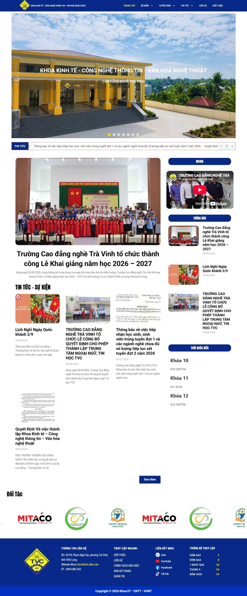
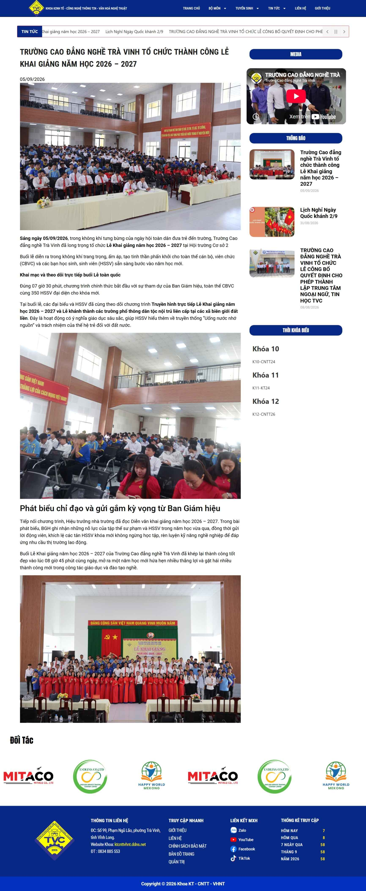
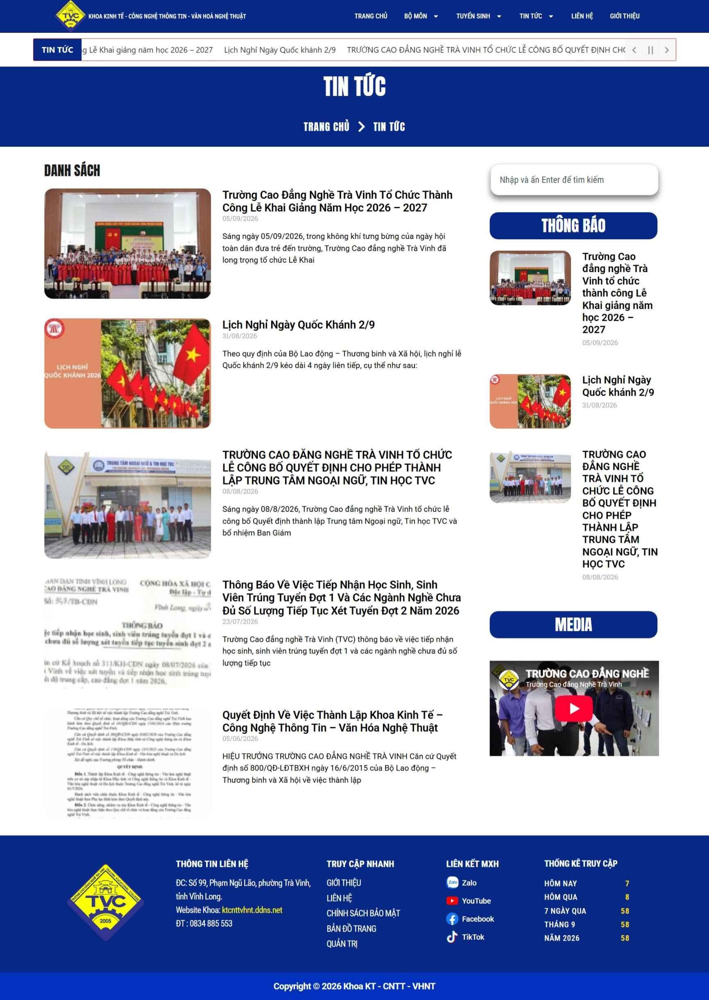
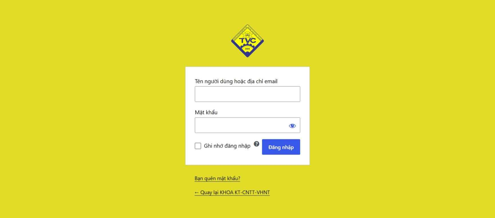
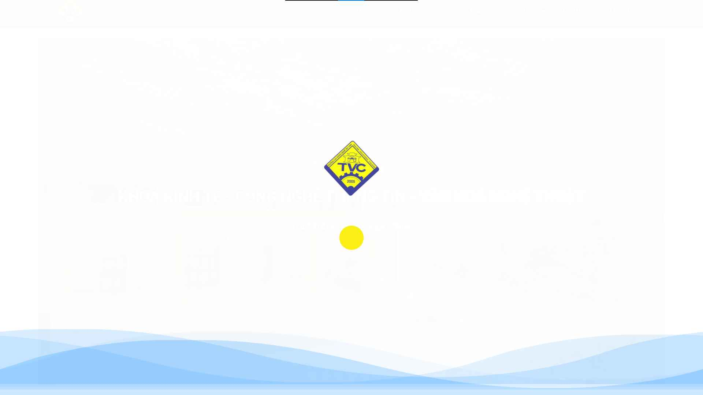

# Website Khoa KT – CNTT – VHNT

Website thông tin của Khoa, phục vụ đăng tin tức, thông báo, tuyển sinh và giới thiệu bộ môn.

## Ảnh demo

| Trang chủ | Chi tiết bài viết |
|---|---|
|  |  |

| Danh sách tin | Đăng nhập | Màn hình chờ |
|---|---|---|
|  |  |  |

## Giới thiệu

- Trang tin tức, thông báo của Khoa.
- Giao diện đơn giản, dễ dùng trên điện thoại và máy tính.
- Có trang quản trị để thầy/cô đăng bài.

## Tính năng chính

- Trang chủ, tin tức, thông báo, tuyển sinh.
- Trang chi tiết bài viết, tìm kiếm.
- Khối Media, thời khóa biểu, đối tác, thống kê lượt xem.
- Trang đăng nhập quản trị riêng.

## Công nghệ

- WordPress
- Docker + Docker Compose
- OpenLiteSpeed + PHP 8.4
- Caddy (reverse proxy, HTTPS tự động)
- MariaDB + Redis (object cache)

## Cấu trúc

```
.
├── Caddyfile            # Cấu hình reverse proxy + HTTPS
├── docker-compose.yml   # db / redis / wordpress / caddy
├── Dockerfile           # OpenLiteSpeed + LSPHP
├── ols-entrypoint.sh    # Fix quyền + nạp env cho PHP
├── uploads.ini          # Cấu hình upload / opcache
├── wordpress/           # Source WordPress (bind mount)
├── screenshots/         # Ảnh demo
└── data/                # Dữ liệu runtime (không commit)
```

## Chạy nhanh

Yêu cầu: Docker + Docker Compose.

```bash
cp .env.example .env
# mở .env điền DB_PASSWORD, REDIS_PASSWORD, SITE_DOMAIN

docker compose up -d --build
```

Mở trình duyệt theo domain đã cấu hình trong `.env`.

## Ghi chú

- File `.env` và thư mục `data/` không được commit lên Git.
- Đổi toàn bộ mật khẩu mặc định trước khi chạy production.
- Backup database định kỳ.

---
© 2026 Khoa KT - CNTT - VHNT. Dùng nội bộ cho mục đích đào tạo.
